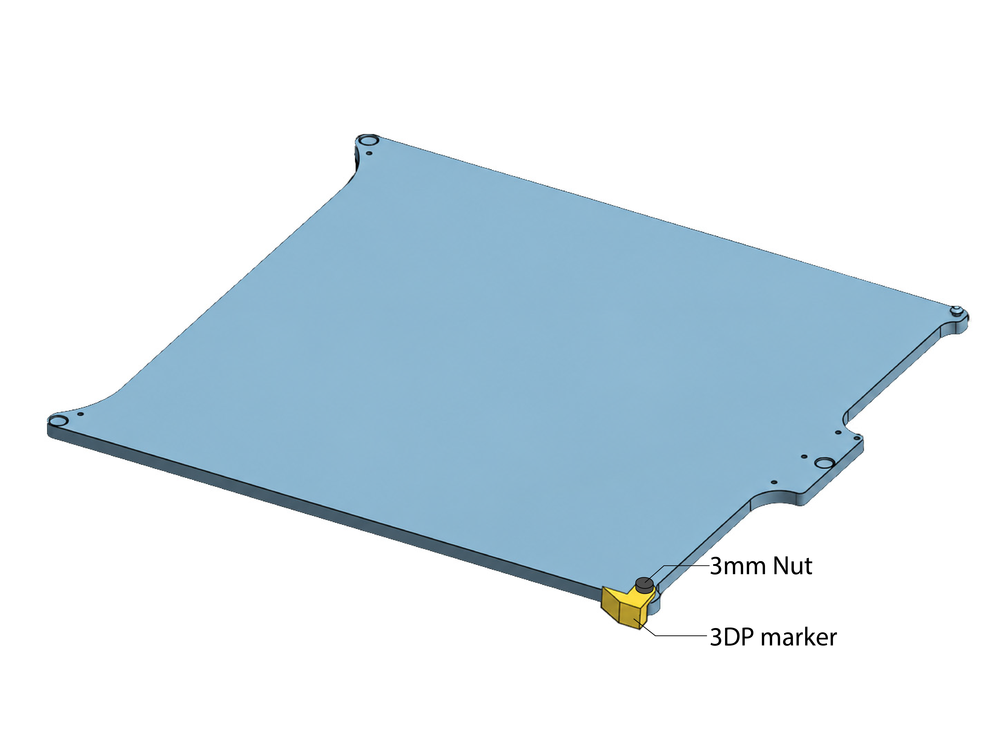
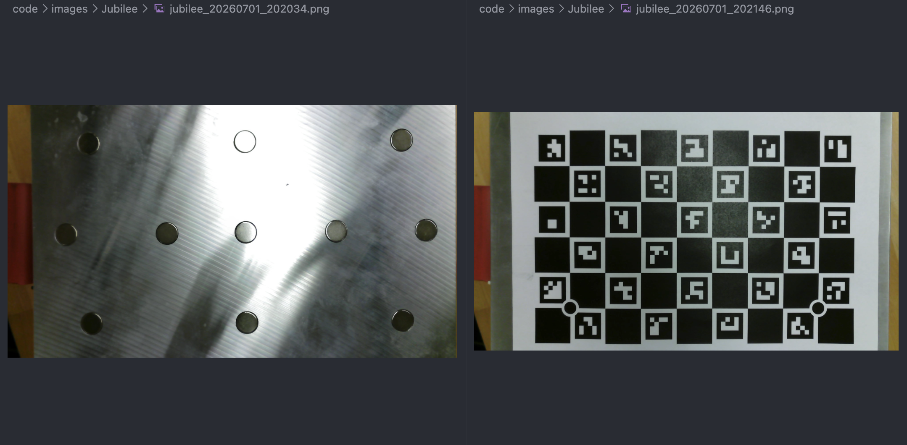
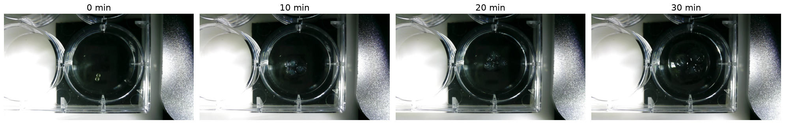

This is the code repo to use xArm for plate transportation between the Jubilee and a plate shelf.

code

# Setup

1. Create python 3.13 virtual environment

   ```shell
   python3.13 -m venv .venv
   source .venv/bin/activate
   ```
2. install xArm-Python-SDK

   ```shell
   git clone https://github.com/xArm-Developer/xArm-Python-SDK.git
   cd xArm-Python-SDK
   pip install .
   ```

   How to connect to xArm:

   * Turn on the power for the xArm, connect ethernet cable to laptop/Raspberry Pi.
   * It takes few seconds for the xArm to establish internet connection, after the connection box makes three beep sound, run the python code for connecting to xArm.
3. install science jubilee

   ```shell
   git clone https://github.com/machineagency/science-jubilee.git
   cd science-jubilee
   python3 -m pip install -e .
   ```
4. Attach the physical marker on the edge of the print plate.

   3D print a [plate edge marker](./hardware/3D models/plate_edge_marker.stl) and attach to the upper right corner of the print plate. This was used for locating the edge for the print plate.

   

# Plate Position Calibration

1. Place the plate on the position you want to register (e.g., shelf/Jubilee), with the 3DP marker on the plate edge closer to the xArm.
2. Run the function `register_position` in `PlateHandler` class.
3. After running the code, manually perform a rough alignment of the xArm to the plate: position the side end stop at the plate’s height and approximately at the midpoint of the plate edge. The holder tool loaded on the xArm should also be approximately parrallel to the plate. Once the rough alignment is complete, press Enter. The xArm will perform automatic calibration process.

# Example Workflow

## Plate transfer & camera capture image

In the camera_workflow_gelinspection.ipynb, we showcased how to use the plate transferring capability with xArm in a webcam capturing workflow. The xArm can pickup different plates on the shelf, put into theJubilee, and use the Jubilee toolhead to pickup a camera tool to capture images of the plate. [Video demo](./video/plate_transfer_cam_workflow.mp4).

example images taken of the different plates:



This could also support multi-plate orchestration workflows, where individual plates might require long overall durations but only brief access to the Jubilee. For example, when monitoring hydrogel swelling and deswelling cycles, the Jubilee may only be needed for a few minutes at each stage to capture images or add water/solution, while the swelling or drying process itself takes several hours. During these waiting periods, the plate can be stored on the shelf and automatically loaded onto the Jubilee only when imaging, solution refilling, or other interventions are required.




# Notes

1. After running the alignment code for the plate at the shelf and Jubilee, the position of the Jubilee and shelf cannot be changed, otherwise needs recalibration.
2. The space between the Jubilee and the shelf should be relatively large to prevent collisions. If the space is too tight, the arm may not be able to move safely or solve a valid path to certain locations.
3. In the Jubilee workflow example, the IP address of the Jubilee was changed to `192.168.2.2` to avoid conflict with xArm address (`192.168.1.205`).
