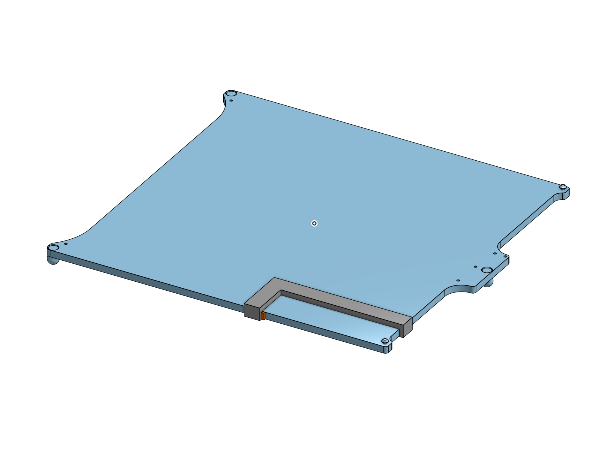
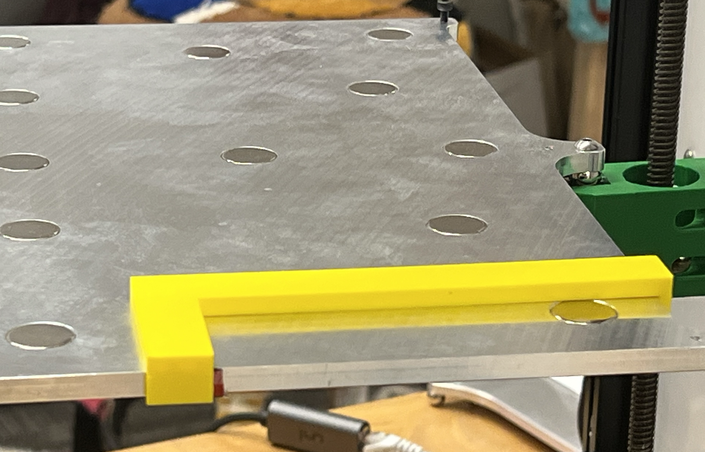

This is the code repo to use xArm for plate transportation between the Jubilee and a plate shelf.

Code & hardware design credit: Nathan

# Setup

1. Create python 3.13 virtual environment

   ```shell
   python3.13 -m venv .venv
   source .venv/bin/activate
   ```
2. install xArm-Python-SDK

   ```shell
   git clone https://github.com/xArm-Developer/xArm-Python-SDK.git
   cd xArm-Python-SDK
   pip install .
   ```
3. Attach the physical marker on the edge of the print plate.

   Use a [3DP jig](./hardware/3D models/Jig_for_marker.stl) to locate and attach a tape marker on the edge of the print plate (sticking a small raised bump part way along the plate with 2 layers of VHB tape, about 2mm wide and 2mm thick). This was used for locating the midpoint for the print plate. In the image below, the orange cube marks the position of the tape.

   

   

# How to run

The controlling code is in `./code/main.ipynb`.

1. Turn on the power for the xArm, connect ethernet cable to laptop
2. It takes few seconds for the xArm to establish internet connection, after the connection box makes three beep sound, run the code cell for "Connecting to XArm" in the python notebook file.
3. Run the code in section "Arm Setup" to initialize functions
4. Run the two code blocks to locate the position of the plate on the shelf and Jubilee
   1. place the plate on the shelf, run the code for "Line up with shelf". After running the code, the xArm needs to be manually rough aligned to the plate position: align the side end stop to the height of the plate, positioning it about 10 mm to the left of the tape marker when facing the plate. After manual aligning, hit enter.
   2. place the plate on Jubilee, run the code for "Line up with Jubilee". Repeat the manual aligning process.
5. Run the transfer plates to test plate transferring.


# Notes

1. After running the alignment code for the plate at the shelf and Jubilee, the position of the Jubilee and shelf cannot be changed, otherwise needs recalibration.
2. The space between the Jubilee and the shelf should be relatively large to prevent collisions. If the space is too tight, the arm may not be able to move safely or solve a valid path to certain locations.
